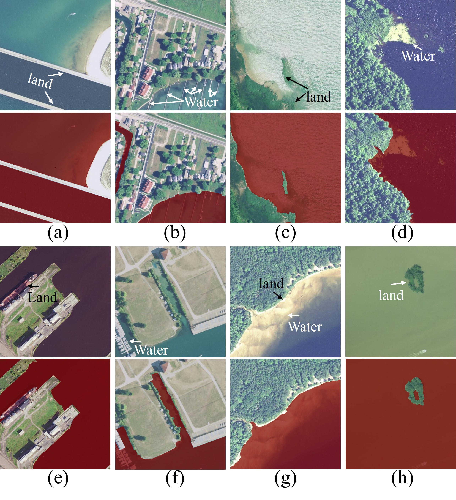

# CAID Dataset and Deep Learning Model Training

## Download the CAID Dataset

Please download the CAID dataset from the following Dropbox link: [Download CAID Dataset](https://www.dropbox.com/scl/fi/6co6777e4az1bsy8z991w/CAID.zip?rlkey=wi92w4cypnth0dq8xr7tir7qv&dl=0)

Run `DistributionAnalysis.ipynb` to visualize dataset distribution.

## Setting Up MMSegmentation

To test deep learning model performance on CAID, first download and install [MMSegmentation](https://github.com/open-mmlab/mmsegmentation).

### Modify `voc.py`

After installation, modify the `voc.py` file located under `mmseg/datasets` to ensure it contains only two classes:

- `background`
- `water`

Also, update the color palette to:

```python
PALETTE = [[0, 0, 0], [128, 0, 0]]
```

### Organizing the Dataset

1. Navigate to the `mmsegmentation` folder.
2. Create a folder named `datasets` if it does not already exist.
3. Unzip the downloaded CAID dataset inside this `datasets` folder.
4. Rename the extracted folder to `voc2012`.

### Copy `my_model` to `mmsegmentation`

Before training, copy the `my_model` folder to the `mmsegmentation` directory:

```bash
cp -r my_model mmsegmentation/
```

Then modify LINE 3 in pascal_voc12.py to your dataset path.

## Training the Model

### Running Training in Terminal

1. Open a terminal and activate the correct Python environment.
2. Run the following command to train CCNet on CAID:
   ```bash
   python tools/train.py --config ./my_model/CCNetBenchmark/ccnet_r50-d8_4xb4-20k_voc12aug-512x512.py --work-dir /home/weiwang/ResearchProjects/mmsegmentation/my_model_res/CCNetBenchmark/
   ```
3. To train other deep learning models provided in the `my_model` folder, run similar commands by replacing the `--config` and `--work-dir` arguments accordingly.
4. Once complete all the training, you can run `DemoAnalysis.ipynb` to see the performance on validation sets during training.

## Performance Testing

### Preparing the Test Set

1. Create a folder named `test_set`.
2. Copy all original images and labeled images into this `test_set`.
3. Inside `test_set`, create two subfolders:
   - `img/` (for original images)
   - `GT_label/` (for labeled images)

### Running Model Inference

Follow the instructions in the [MMSegmentation documentation](https://mmsegmentation.readthedocs.io/en/latest/) to demo the trained model on the `img` folder inside `test_set`. Save the segmentation results into corresponding subfolders within `test_set`.

---

Once you have completed inferencing the test images and placed the results into the corresponding folders, you can follow `BenchDemoAnalysis.ipynb` and `TestParamsAnalysis.ipynb` to plot the examples and show the statistics.

By following these steps, you will successfully set up, train, and evaluate a deep learning model on the CAID dataset using MMSegmentation.

## Images accessbility
The aerial imagery is provided by United States Department of Agriculture (USDA), which provides authorization for freely use. https://www.fsa.usda.gov/help/accessibility-statement

## Contributors
Wei Wang, University of Wisconsin, Madison

Boyuan Lu, University of Wisconsin, Madison

Yihan Li, University of Wisconsin, Madison

Weiyan Shi, Singapore University of Technology and Design

[](https://doi.org/10.5281/zenodo.16461280)

## Citation
```bib
@ARTICLE{11125715,
  author={Wang, Wei and Lu, Boyuan and Li, Yihan and Shi, Weiyan},
  journal={IEEE Data Descriptions}, 
  title={Descriptor: Coastal Aerial Imagery Dataset for Shoreline Segmentation (CAID)}, 
  year={2025},
  volume={},
  number={},
  pages={1-11},
  keywords={Sea measurements;Image segmentation;Benchmark testing;Accuracy;Labeling;Training;Lakes;Image edge detection;Boats;Algae;Aerial imagery;coastal;shoreline;segmentation;the Great Lakes},
  doi={10.1109/IEEEDATA.2025.3599116}}
```
W. Wang, B. Lu, Y. Li and W. Shi, "Descriptor: Coastal Aerial Imagery Dataset for Shoreline Segmentation (CAID)," in IEEE Data Descriptions, doi: 10.1109/IEEEDATA.2025.3599116.


